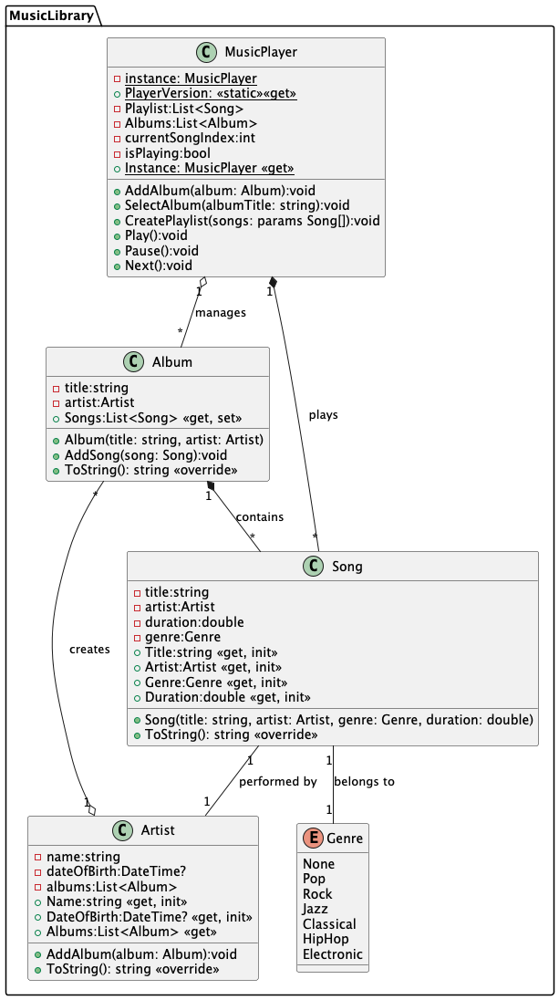

# **Music Library Management** 🎵

### **Description**

Create a system to manage a music library. The system should keep track of **artists**, their **albums**, and **songs**.

### **Main Classes**

1. **`Artist`**
    - **Properties:**
        - `string Name` — the name of the artist.
        - `string Genre` — the music genre.
        - `List<Album> Albums` — a list of albums.
    - **Method:**
        - `void AddAlbum(Album album)` — add an album to the artist.

2. **`Album`**
    - **Properties:**
        - `string Title` — the title of the album.
        - `DateTime ReleaseDate` — the release date.
        - `List<Song> Songs` — a list of songs.
    - **Method:**
        - `void AddSong(Song song)` — add a song to the album.

3. **`Song`**
    - **Properties:**
        - `string Title` — the title of the song.
        - `TimeSpan Duration` — the duration of the song.
        - `Artist Performer` — the artist who performs the song.

### **Examples**

1. Create several artists and albums.
2. Add songs to albums.
3. Display all albums for a specific artist.
4. Calculate the total number of songs and the total duration of all albums.
5. Find the longest song by an artist.

---

